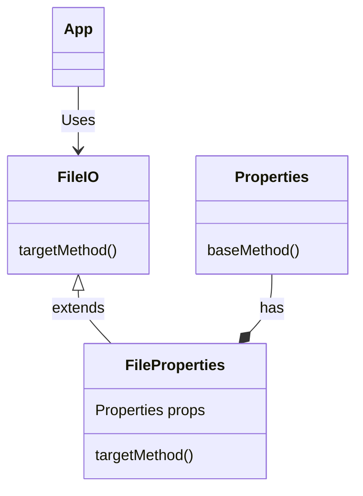

# 委譲による Adopter

```mermaid
classDiagram
    App --> FileIO: Uses
    FileIO <|-- FileProperties: extends
    FileIO: targetMethod()
    Properties --* FileProperties: has
    Properties: baseMethod()
    FileProperties: targetMethod()
    FileProperties: Properties props
```